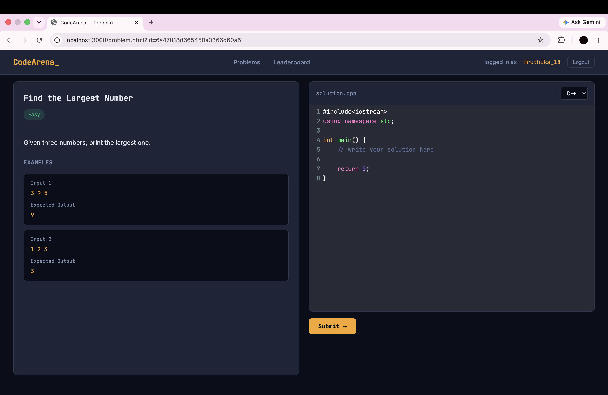

# CodeArena 🏟️

A full-stack online judge platform where users can solve coding problems, submit real C++ solutions that get compiled and executed on the server, and compete on a live leaderboard — built from scratch without using any third-party judge APIs.

## What it does

- Browse a list of coding problems with difficulty ratings
- Write and submit C++ solutions in a browser-based code editor
- Server compiles and runs your code against real test cases
- Get instant verdicts: Accepted, Wrong Answer, Time Limit Exceeded, Compilation Error, or Runtime Error
- Compete with other users on a live leaderboard ranked by accepted submissions

## Tech Stack

**Backend**
- Node.js + Express.js — REST API server
- MongoDB + Mongoose — stores problems and test cases (flexible schema)
- SQLite (better-sqlite3) — stores users and submissions (relational data)
- JWT (jsonwebtoken) + bcryptjs — authentication and password hashing
- Child Process (Node.js built-in) — compiles and executes C++ submissions

**Frontend**
- Vanilla HTML, CSS, JavaScript — no frameworks
- CodeMirror — browser-based code editor with C++ syntax highlighting

## How the judge works

When a user submits code:
1. The server saves the code string to a temporary `.cpp` file
2. Runs `g++` to compile it — returns **Compilation Error** if it fails
3. Executes the compiled binary, feeding test case input via `stdin`
4. A 5-second timeout kills the process if it runs too long — **Time Limit Exceeded**
5. Compares the program's `stdout` output against the expected answer
6. Returns **Accepted** if all test cases pass, **Wrong Answer** with the failing input if not
7. Saves the submission result to the database and cleans up temp files

## Why two databases?

- **MongoDB** for problems — each problem has a different number of test cases, examples, and constraints. The flexible document schema handles this naturally.
- **SQLite** for users and submissions — this data is strictly relational. A submission always belongs to exactly one user and one problem, and the leaderboard needs JOIN queries and ranking. SQL is the right tool for that.

## Project structure
CodeArena/
├── public/                  # Frontend — served as static files
│   ├── css/
│   │   └── style.css        # Shared design system (navy + amber theme)
│   ├── js/                  # CodeMirror (local)
│   ├── index.html           # Login / Signup page
│   ├── problems.html        # Problem list page
│   ├── problem.html         # Problem detail + code editor + submit
│   └── leaderboard.html     # Rankings page
├── Src/
│   ├── middleware/
│   │   ├── auth.js          # JWT verification middleware
│   │   └── errorHandler.js  # Centralized error handling middleware
│   ├── models/
│   │   └── Problem.js       # Mongoose schema for problems
│   ├── routes/
│   │   └── auth.js          # /auth/signup and /auth/login routes
│   ├── database.js          # SQLite setup and table initialization
│   ├── db.js                # MongoDB connection
│   ├── judge.js             # Core judge logic — compile, run, compare
│   └── server.js            # Express app — all routes + middleware
├── .env.example             # Environment variable template
├── .gitignore
└── package.json

